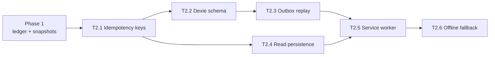

````markdown
# IMS — Task Backlog

Generated from a full read-through of the codebase. Every claim below was verified
against the source, with file:line references.

**Total:** 26 tasks across 6 phases.

---

## Phase 0 — Stop the bleeding

| ID | Task | Scope | Done when |
|---|---|---|---|
| **T0.1** ✅ | Fix work-order `itemId` corruption | `lib/work-order-item.ts`, `app/api/work-orders/route.ts`, `app/(dashboard)/production/page.tsx`, `scripts/fix-work-order-item-ids.ts` | **Done.** Rule extracted to `resolveWorkOrderItem`; route derives `itemId` from `Bom.finishedSku` and returns 422 on mismatch or unknown SKU. Client no longer sends `itemId`. Repair script ran clean: 162 work orders, 0 corrupt. |
| **T0.2** ✅ | Bootstrap Vitest | `package.json`, `vitest.config.ts`, `tests/**` | **Done.** `npm test` runs 149 tests across `date-range`, `rbac` (9 roles x 10 modules), `utils`, plus regression cover for T0.1. |

> **Resolved.** T0.1 shipped first, even though it looked cosmetic. `itemId` was
> set to `selectedBom?.components?.[0]?.item?.id` — the *first component's*
> item. Since components are raw materials, every work order created through
> that dialog was finished against cement or sand. Completing one hit the
> `stockLevel.upsert` at `app/api/work-orders/[id]/route.ts:26` and
> **incremented raw material stock**. That was active inventory corruption, not
> a display bug.
>
> The route now derives `itemId` from `Bom.finishedSku`. The remaining stock bug
> is that completion still *increments* without consuming components — T1.4.

---

## Phase 1 — Data integrity

The core refactor. Nothing in Phase 2 is trustworthy until this lands.

| ID | Task | Scope | Done when |
|---|---|---|---|
| **T1.1* | `updatedAt` on missing models | `Warehouse`, `Customer`, `Supplier`, `Bom` | All four gain `updatedAt`. Required by the optimistic-concurrency checks in T2.1. |

### Notes

- **Negative-stock policy** — decide once inside T1.2: hard-block below zero, or
  allow with a warning flag. Apply uniformly.
- Prisma returns `Decimal` as strings (see `features/inventory/services/item-service.ts:8`).
  Keephat in mind for any aggregation added later.

---

## Phase 2 — Offline support



| ID | Task | Scope | Done when |
|---|---|---|---|
| **T2.1** | Idempotency keys on mutations | `AuditLog.metadata`, all mutating routes | Client sends `Idempotency-Key`; server upserts on it. Replaying the same request twice is a no-op. Without this, T2.3 replays double-increment stock. |
| **T2.2** | Dexie outbox schema | new `lib/offline/db.ts` | Versioned stores: `outbox` (id, url, method, body, idempotencyKey, createdAt, attempts, status), `conflicts`, `meta`. IndexedDB only — not localStorage. |
| **T2.3** | Outbox enqueue + replay | new `lib/offline/outbox.ts` | Offline mutations queue instead of throwing. Replay on `onlineManager` event **and** `visibilitychange`. Pauses on 401 and prompts re-login without discarding the queue. |
| **T2.4** | Persist query cache | `components/shared/providers.tsx:16`, `features/inventory/hooks/use-items.ts` | `PersistQueryClientProvider` + `createIDBStorage()`. List pages render from cache with no per-page code. `maxAge` set so stale data is labelled, not silently trusted. |
| **T2.5** | Service worker + manifest | `public/sw.js`, `manifest.json` | Cache-first `/_next/static`, network-first navigation falling back to `/offline`. **Authenticated HTML is never cached.** |
| **T2.6** | Offline states for server routes | `dashboard`, `reports`, `mrp` pages | These are `force-dynamic` Postgres reads that *will* fail offline. Give each an explicit offline panel. |

### Constraints that will bite

- **Background Sync is Chromium-only.** iOS Safari has no support at all, so
  replay must also trigger on `visibilitychange` and TanStack `onlineManager`.
- **IndexedDB is evicted after ~7 days** without launch for non-installed PWAs.
  Ship `manifest.json` and prompt install, or long-lived offline sessions lose
  the queue silently.
- **Never cache authenticated HTML.** It survives logout and leaks one user's
  data to the next on a shared plant-floor terminal. The Next.js RSC payload is
  user-specific.
- **Auth expiry is the real failure mode.** The NextAuth JWT is HttpOnly (client
  JS cannot read it) and `/api/auth/session` is itself a network call, so
  `SessionProvider` (`providers.tsx:22`) rejects offline. The outbox must pause
  on 401 — not fail-and-drop. Do not fake continuity by persisting a session
  snapshot; that extends access after a password change.

### Scope

Offline **writes**: stock counts, lab result entry, WO status transitions.
Online **only**: MRP runs, report export, dashboard aggregates, anything with
server-side aggregation.

---

## Phase 3 — Finish the stubs

| ID | Task | Scope | Done when |
|---|---|---|---|
| ~~**T3.1**~~ ✅ | Notifications | new model, `app/api/notifications`, `components/layout/topbar.tsx:81` | `Notification` model + read/unread. Bell stops showing a hardcoded `3` (it has no `onClick` today). Reorder-point breaches and low stock raise one. |
| ~~**T3.2**~~ ✅ | Email delivery | `lib/actions/auth.ts:30` | Resend or Nodemailer sends the real link; `devResetUrl` returned only under `NODE_ENV=development`. |
| ~~**T3.3**~~ ✅ | Finance module | net-new models + routes + page | `SupplierInvoice` / `CustomerInvoice` with payment status, plus a `Role.FINANCE` entry in `nav-items.ts` and `MODULE_PERMISSIONS`. |
| ~~**T3.4**~~ ✅ | HR module | net-new models + routes + page | `Employee` + `Attendance`, `Role.HR` nav entry. |
| ~~**T3.5**~~ ✅ | MRP → draft POs | `lib/inventory/mrp-to-po.ts`, `app/api/mrp/[id]/purchase-orders` | The cheap add from this window. Suggestions grouped into one DRAFT PO per supplier, each `MrpLine` linked back so re-running cannot double-order. |

### T3.1 — notifications

`Notification` + `NotificationRead`. Read state is per user, not a column on the
notification: a single `readAt` would let the first person to open the bell
silence a stock-out alert for everyone else.

Alerts fire on a **transition**, not on a level — `lib/notifications/reorder.ts`
compares stock before and after each movement and only raises when an item
crosses the threshold. This is wired into the three movement call sites
(`work-orders/[id]`, `sales-orders/[id]`, `purchase-orders/[id]`).

`module key: notifications` is granted to **all** nine roles, including
`EMPLOYEE`. The bell is not a privilege.

### T3.3 — finance

Invoice status is **derived, not stored**: `OVERDUE` becomes true at midnight on
a document nobody touched, so writing it would need a nightly job to undo it.
`lib/finance/invoice.ts` computes it on read; `DRAFT` and `CANCELLED` are the
only hand-settable states.

`Payment` has two nullable invoice FKs because it serves both directions.
Postgres cannot require exactly one to be set, so that rule lives in the route.

An invoice with payments **cannot be deleted** — payments cascade, so deleting
would take the ledger with it. Those get `CANCELLED` instead.

### T3.5 — MRP → draft POs

`Item.preferredSupplierId` is snapshotted onto `MrpLine.supplierId` when the run
is computed, so editing the item master later cannot rewrite which supplier a
past run proposed. `MrpLine.purchaseOrderId` is set on generation, which is what
makes the button idempotent.

Items with no preferred supplier are **skipped and reported**, never guessed —
assigning a cement order to the steel supplier's account is worse than
generating nothing.

> The README claims HR / Finance / QC are "scaffolded." They are not —
> `prisma/schema.prisma` contains no HR, Finance, or Machine models at all.
> `Role.HR` and `Role.FINANCE` exist in `lib/rbac.ts` and grant dashboard access
> only. T3.3 and T3.4 are two full modules, not stub fill-ins.

**Cheap add in this window:** MRP -> auto-generate draft POs grouped by supplier.
`app/api/mrp` computes suggestions, stores them, and then dead-ends.

**Not scheduled:** Maintenance / OEE (machines, molds, downtime). The largest
untouched module and the most-requested one in real MES products. Worth its own
phase later.

---

## Phase 4 — Usability

| ID | Task | Scope | Done when |
|---|---|---|---|
| **T4.1** | Pagination + sorting | inventory UI, `app/api/items` | `@tanstack/react-table` pagination/sorting wired up. The server already accepts `page`/`pageSize`; the UI ignores them. |
| **T4.2** | Row-level edit dialogs | items, customers, suppliers, BOMs | PATCH exists but is status-only. Real edit dialogs per entity. |
| **T4.3** | File upload | new route, Neon Object Storage | Presigned uploads for lab attachments, item photos, PO PDFs. `@neon/config` is already a dependency. |
| **T4.4** | i18n: drop DOM mutation | `lib/i18n.tsx:482-518` + every page | `translateRenderedDocument` and its `MutationObserver` deleted; hardcoded Arabic routed through `t()`. |

> T4.4 is the largest mechanical diff in the plan — it touches every page.
> Do it alone, with no other changes in the same pass. The current approach
> (a `MutationObserver` rewriting DOM text nodes) breaks on dynamically
> injected content, causes layout thrash, and makes translated strings
> ungreppable.

---

## Phase 5 — Engineering hygiene

| ID | Task | Scope | Done when |
|---|---|---|---|
| **T5.1** | CI workflow | `.github/workflows/ci.yml` | `tsc --noEmit` + lint + `prisma migrate deploy`. Catches the build/migration drift that only surfaces on Vercel. |
| **T5.2** | Delete dead deps | `package.json`, `hello.ts`, `neon.ts`, `Session` | Remove `zustand`, `framer-motion`, `@auth/prisma-adapter`, and the empty `features/{production,sales,purchasing}`, `hooks/`, `services/`, `styles/` directories. |
| **T5.3** | Playwright E2E | new | login -> create sales order -> fulfil -> assert a stock movement exists. One happy path, end to end. |

### Caveats on T5.2

- **Keep the `Session` model.** Deleting it while on JWT sessions removes the
  only revocation hook, and you want the opposite — a deactivated user currently
  keeps access until token expiry.
- **Keep `@tanstack/react-table`** if T4.1 is done. It is currently a
  zero-import dead dependency, so skip T4.1 and it joins the delete list.

---

## Execution order

```
T0.1 -> T0.2 -> T1.1 -> T1.2 -> T1.3 -> T1.4 -> T1.5 -> T1.6 -> T1.7
      -> T2.1 -> T2.2 -> T2.3 -> T2.4 -> T2.5 -> T2.6
      -> T3.1 -> T3.2 -> T3.3 -> T3.4 -> T3.5
      -> T4.1 -> T4.2 -> T4.3 -> T4.4
      -> T5.1 -> T5.2 -> T5.3
```

Progress: **Phases 0–3 complete**, including the MRP → draft-PO add from the
Phase 3 window. Next up is **T4.1** (pagination + sorting in the inventory UI);
the server already accepts `page`/`pageSize` and the UI ignores them.

Do T4.4 alone. It is the largest mechanical diff in the plan and touches every
page.

Phases 0-1 are the real work; everything after is additive.

**Gate:** every task ends with `npm run build` and `npm test` green before the
next begins. Phase 1 in particular rewrites four routes that currently mutate
stock.

---

## Verification notes

Claims confirmed against source while building this list:

- COGS resolved from `Item.costPrice` at query time — `lib/dashboard-metrics.ts:164-186`
- `AuditLog` has zero writers and zero readers outside `prisma/schema.prisma`
- Stock mutated in exactly 2 places, both `increment`, never `decrement`
- `Bom.finishedSku` is free text — `prisma/schema.prisma:149`
- Notification bell hardcoded — `components/layout/topbar.tsx:83`
- Dev reset link returned — `lib/actions/auth.ts:30`
- Zero imports of `zustand`, `framer-motion`, `@auth/prisma-adapter`, `@tanstack/react-table`
- No test runner in `package.json`; no `.github/` directory
- `README.md` is stale — omits `lib/i18n.tsx`, `lib/report-data.ts`,
  `lib/report-workbook.ts`, `lib/date-range.ts`, and the lab module entirely
````

Save that as `TASKS.md` in the repo root. I* | Add `StockMovement` ledger | `prisma/schema.prisma` + migration | Model with signed `qtyDelta`, `reason` enum, `refType`/`refId`, `occurredAt`; indexes on `[itemId, occurredAt]`. Migration applied. |
| **T1.2** | Centralize stock mutation | new `lib/inventory/stock-service.ts` | Single `applyMovement(tx, input)` used by every call site. Both existing `stockLevel.upsert` calls deleted. `StockLevel` becomes a projection updated in the same `$transaction` as the movement insert. |
| **T1.3** | `Bom.finishedSku` -> FK | `prisma/schema.prisma:149` | `finishedItemId String` + `finishedItem Item @relation(...)`. Backfill by `sku` match; fail loudly on orphans. Unblocks T0.1. |
| **T1.4** | Consume BOM on WO completion | `app/api/work-orders/[id]/route.ts` | `COMPLETED` writes one negative movement per `BomComponent` plus one positive for the finished good, in a single tx. Unavailable components reject the transition. Support scrap / no-scrap. |
| **T1.5** | Deduct stock on sales fulfilment | `app/api/sales-orders/[id]/route.ts` | `FULFILLED` writes negative movements per line. Currently deducts nothing at all. |
| **T1.6** | `unitCost` snapshot on sales lines | `prisma/schema.prisma:314`, `lib/dashboard-metrics.ts:164` | `SalesOrderLine.unitCost Decimal?` written on fulfilment. `loadSales` reads `line.unitCost ?? item.costPrice`. Editing an item's cost no longer moves last quarter's reported margin. |
| **T1.7**t needs no build step and won't affect the app. t